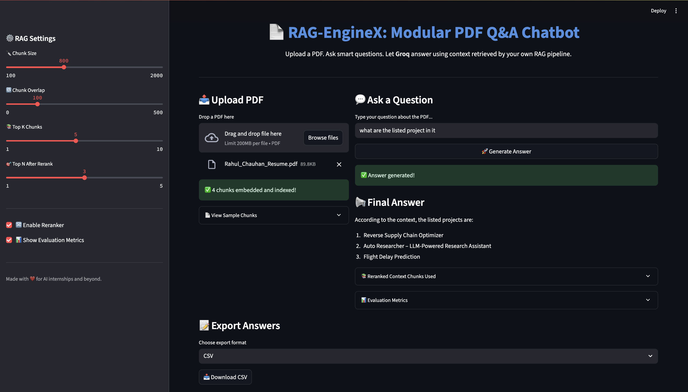
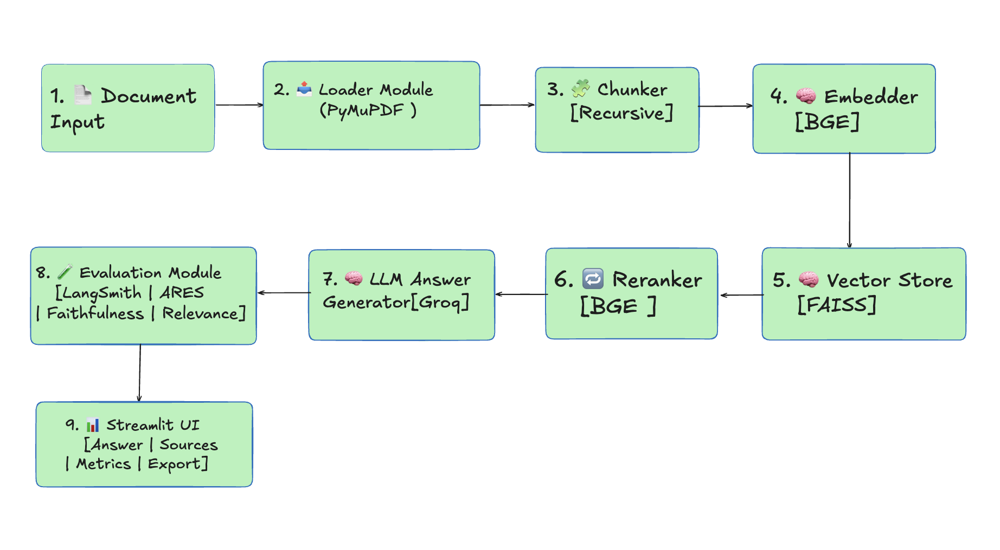
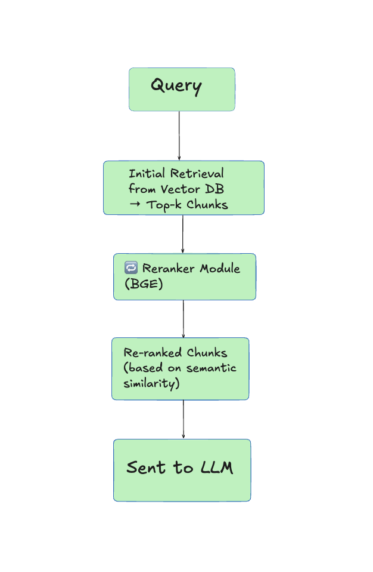
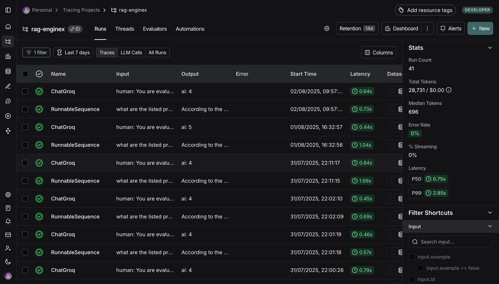
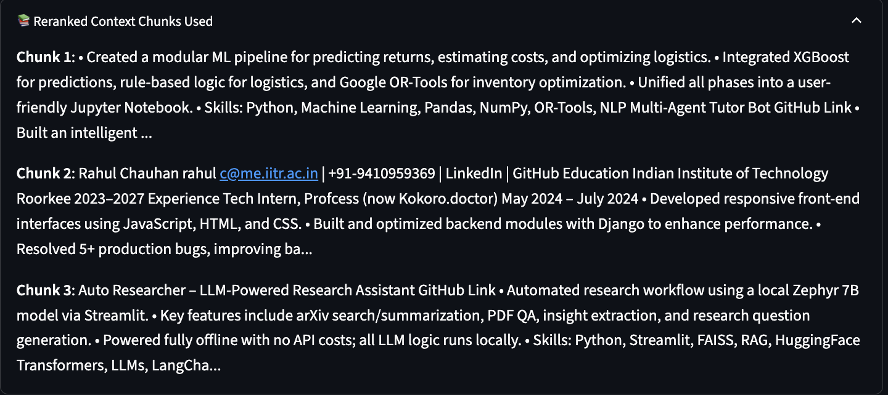
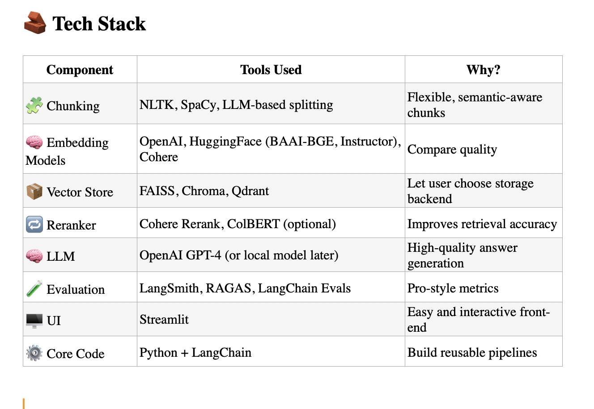

# 🔍 RAG-EngineX

**RAG-EngineX** is a professional-grade, modular, and fully customizable **Retrieval-Augmented Generation (RAG)** framework for document-based Q&A. It features advanced chunking strategies, vector-based search, reranking with cross-encoders, LangSmith-powered observability, and detailed evaluation using ARES, faithfulness, and relevance metrics — all wrapped in an intuitive **Streamlit UI**.

---

## 🚀 Demo

🔗 **Try it now:** [👉 RAG-EngineX on Render](https://rag-enginex.onrender.com)


🎥 **Watch Walkthrough Video (2 min)**  


[](https://www.loom.com/share/d76911e2d84440f58a7032df410bd317?sid=aef04d04-d16d-4145-9a58-52944d53fc6c)

---

## ✨ Features

- 📄 **Multi-format Document Loader** – Load PDFs and other formats with modular loader components.

- 🧩 **Custom Chunking Strategies** – Choose from character, recursive, or semantic chunking.

- 🧠 **Pluggable Embedding Models** – Support for `sentence-transformers`, `OpenAI`, or custom models.

- 📦 **Vector Store Flexibility** – Use FAISS, Chroma, or any LangChain-supported store.

- 🔁 **Reranking Module** – Improve retrieval relevance with cross-encoder rerankers.

- 🧪 **Evaluation Metrics** – Faithfulness, relevance, ARES, and custom scoring.

- 📊 **LangSmith Integration** – Trace every prompt-response interaction with latency tracking.

- 💻 **Streamlit UI** – Clean, interactive, and exportable frontend interface.

- 🛠️ **Fully Modular Codebase** – Easy to extend and integrate with other pipelines.

- 📤 **Answer Export** – Download results in JSON/CSV for audits or further analysis.

---

## 🧠 Architecture

RAG-EngineX follows a modular pipeline from loading documents to evaluating responses, with each component decoupled for full flexibility.

### 1️⃣ 📌 High-Level Pipeline Overview

Shows the flow of a document through the complete RAG-EngineX pipeline:




---

### 2️⃣ 🤖 Reranker Subsystem

The reranker improves retrieval quality using a BGE cross-encoder before passing results to the LLM:



---

### 3️⃣ 📊 LangSmith + Evaluation Module

Traces and evaluates generated answers using LangSmith and in-app scoring (ARES / Relevance / Faithfulness):


---

## 🖼 UI & Screenshots

The Streamlit UI is designed for interactivity and insight. It shows answers, sources, evaluation metrics, and supports exporting results.

### 🔍 LangSmith Trace Viewer



---

### 📈 Evaluation Metrics View (ARES / Relevance / Faithfulness)


---

### 🧠 Reranker Comparison View



---

### 🖥️ Main Streamlit App UI


---

## ⚙️ Tech Stack

---

```
## 📁 Project Structure

rag-enginex/
│
├── rag_enginex/             # Core pipeline logic
│   ├── loader.py            # Document loading
│   ├── chunker.py           # Chunking logic
│   ├── embedder.py          # Embedding generation
│   ├── vector_store.py      # Vector DB interaction
│   ├── reranker.py          # Cross-encoder reranker
│   ├── llm_answer.py        # LLM query and generation
│   ├── evaluator.py         # Automated eval (ARES etc.)
│   ├── evaluator_manual.py  # Manual scoring 
│   ├── llm_wrapper.py       # LLM abstraction
│   └── pipeline.py          # Orchestrates entire flow
│
├── ui.py                    # Streamlit UI
├── requirements.txt         # Python dependencies
├── runtime.txt              # Python version for Render
├── Procfile                 # Web server entry point
├── .streamlit/
│   └── config.toml          # Theme and server settings
└── assets/
    ├── LangSmith.png
    ├── Reranker.png
    ├── Evaluation Metrices.png
    ├── UI.png
    ├── pipeline_overview.png
    ├── reranker_architecture.png
    ├── langsmith_evaluation.png
    └── tech_stack.png

```


---
```
## 🛠️ Setup & Deployment

### 🔧 Local Development


 1. Clone the repo
git clone https://github.com/yourusername/rag-enginex.git
cd rag-enginex

 2. Create a virtual environment
python -m venv venv
source venv/bin/activate  # or venv\Scripts\activate on Windows

 3. Install dependencies
pip install -r requirements.txt

 4. Run locally
streamlit run ui.py
```

```
🚀 Deployment on Render.com

Full guide available here: Deploying RAG-EngineX to Render

Basic steps:

Push code to GitHub.

Create new Web Service on Render.

Set build command to :
    pip install -r requirements.txt.

Set start command to :
    streamlit run ui.py --server.port 10000.

Add runtime.txt with Python version.

Add Procfile with:

    web: streamlit run ui.py --server.port $PORT

(Optional) Set up .streamlit/config.toml to customize theme.
```

```
📤 Export & Evaluation Features:

    ✅ Faithfulness and relevance scores shown in collapsible sections.

    ✅ Evaluation results (JSON/CSV) downloadable via UI.

    ✅ Easily switch between auto-eval and manual evaluation.
```
```
✍️ Blogs & Write-ups
📘 Coming Soon on Hashnode

    “Building a Modular RAG Pipeline from Scratch”

    “How to Evaluate RAG Systems Without OpenAI”

    “Streamlit + LangChain: Perfect UI for Document QA”
```
```
🤝 Contributing
    Contributions are welcome! Feel free to submit issues or pull requests.
```
```
📜 License
    MIT License © Rahul Chauhan
```
```
🙌 Acknowledgments
    LangChain for modular building blocks

    LangSmith for observability

    HuggingFace & Sentence-Transformers for embeddings

    Papers like ARES & RAGAS for evaluation inspiration
```
---

---

✅ Next Steps (optional):
- I can save this as `README.md` and export it for your GitHub.
- Help you write the Render deployment guide mentioned above.
- Help you turn this into a blog post on Hashnode.


